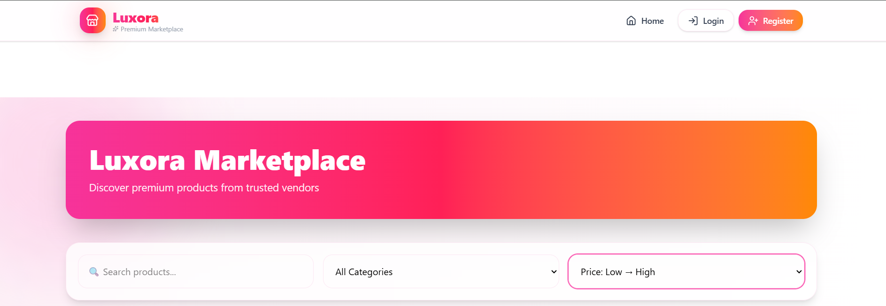
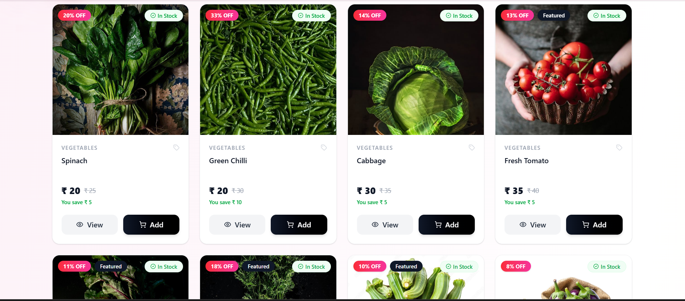
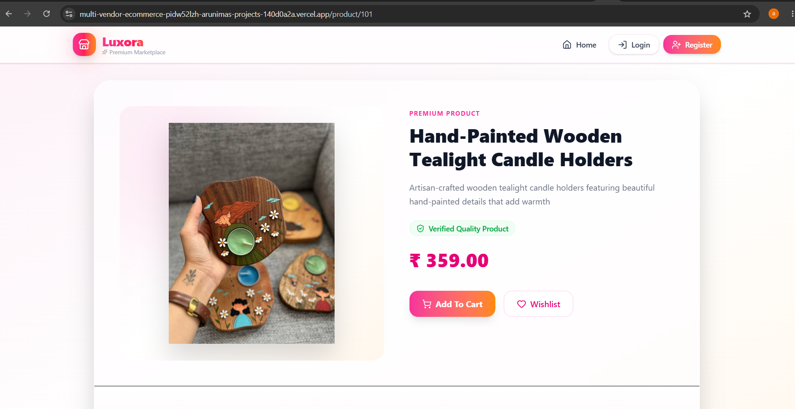
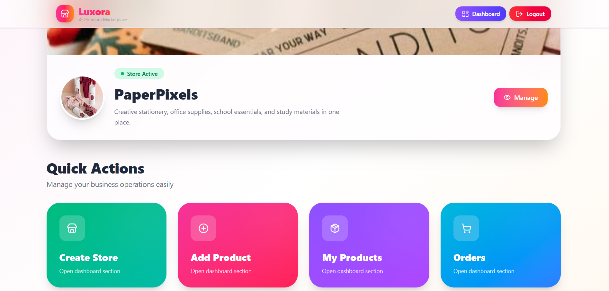

# 🛍️ Multi Vendor Ecommerce Platform

A full-stack Multi Vendor Ecommerce Platform built using Django, Django REST Framework, React, Redux Toolkit, and PostgreSQL.

This application allows multiple vendors to manage and sell products through a single marketplace while customers can browse products, place orders, and track purchases.

---

## 🚀 Project Highlights

- Multi Vendor Marketplace
- JWT Authentication & Authorization
- Product Management System
- Shopping Cart & Checkout
- Order Management
- Vendor Dashboard
- Admin Dashboard
- RESTful API Architecture
- Responsive User Interface

---

## 🛠️ Tech Stack

### Frontend
- React.js
- Redux Toolkit
- Axios
- Bootstrap / Tailwind CSS

### Backend
- Django
- Django REST Framework
- JWT Authentication

### Database
- PostgreSQL

### Tools
- Git
- GitHub
- Postman

---

## 📌 Features

### 👤 Customer Features

- User Registration & Login
- Browse Products
- Search Products
- Product Details Page
- Add to Cart
- Wishlist
- Place Orders
- View Order History
- Profile Management

### 🏪 Vendor Features

- Vendor Registration
- Vendor Dashboard
- Add Products
- Update Products
- Delete Products
- Manage Inventory
- View Orders

### 🔧 Admin Features

- Manage Users
- Manage Vendors
- Manage Products
- Manage Categories
- Monitor Orders
- Platform Control

---

## 🏗️ System Architecture

```text
React Frontend
      │
      ▼
Django REST API
      │
      ▼
 PostgreSQL Database
```

---

## 📂 Project Structure

```bash
multi-vendor-ecommerce/

backend/
│
├── users/
├── vendors/
├── products/
├── orders/
├── payments/
├── reviews/
├── wishlist/
└── manage.py

frontend/
│
├── src/
├── components/
├── pages/
├── redux/
├── services/
└── assets/
```

---

## ⚙️ Installation Guide

### 1. Clone Repository

```bash
git clone https://github.com/Arunimatechy/multi-vendor-ecommerce.git

cd multi-vendor-ecommerce
```

---

### 2. Backend Setup

Create Virtual Environment

```bash
python -m venv venv
```

Activate Environment

Windows

```bash
venv\Scripts\activate
```

Linux/Mac

```bash
source venv/bin/activate
```

Install Dependencies

```bash
pip install -r requirements.txt
```

Apply Migrations

```bash
python manage.py makemigrations

python manage.py migrate
```

Create Admin User

```bash
python manage.py createsuperuser
```

Run Server

```bash
python manage.py runserver
```

---

### 3. Frontend Setup

```bash
cd frontend

npm install

npm run dev
```

---

## 🔐 Environment Variables

Create a .env file:

```env
SECRET_KEY=your_secret_key

DEBUG=True

DB_NAME=your_database_name
DB_USER=your_database_user
DB_PASSWORD=your_database_password
DB_HOST=localhost
DB_PORT=5432

JWT_SECRET_KEY=your_jwt_secret_key
```

---

## 📡 API Modules

### Authentication

```http
POST /api/auth/register/
POST /api/auth/login/
POST /api/auth/logout/
```

### Products

```http
GET    /api/products/
GET    /api/products/:id/
POST   /api/products/
PUT    /api/products/:id/
DELETE /api/products/:id/
```

### Orders

```http
GET    /api/orders/
POST   /api/orders/
```

### Vendors

```http
GET    /api/vendors/
POST   /api/vendors/
```

---

## 🎯 Learning Outcomes

This project helped me gain practical experience in:

- Full Stack Web Development
- REST API Development
- Authentication & Authorization
- Database Design
- State Management with Redux Toolkit
- Frontend and Backend Integration
- Git & GitHub Workflow
- Project Deployment

---

## 📸 Screenshots


### 🏠 Home Page



Customers can browse products, categories, and featured items from the marketplace.

---

### 📦 Product Page



Detailed product information including pricing, stock status, and descriptions.

---

### 📦 Product Details



View detailed product information, pricing, descriptions, and images.

---
### 🏪 Vendor Dashboard



Vendors can manage products, inventory, and customer orders from a dedicated dashboard.

---


---

## 🚀 Future Enhancements

- Online Payment Gateway Integration
- Product Recommendation System
- Real-Time Notifications
- Email Verification
- Docker Deployment
- AI Powered Search
- Advanced Analytics Dashboard

---

## 🤝 Contributing

Contributions are welcome.

1. Fork the repository
2. Create a feature branch
3. Commit changes
4. Push to GitHub
5. Create a Pull Request

---

## 👨‍💻 Developer

### Arunima

Full Stack Developer

**Skills**
- React.js
- Redux Toolkit
- JavaScript
- Python
- Django
- Django REST Framework
- PostgreSQL
- Git & GitHub

GitHub:
https://github.com/Arunimatechy

---

## ⭐ Support

If you found this project useful, consider giving it a star on GitHub.

⭐ Star the repository to support the project.
